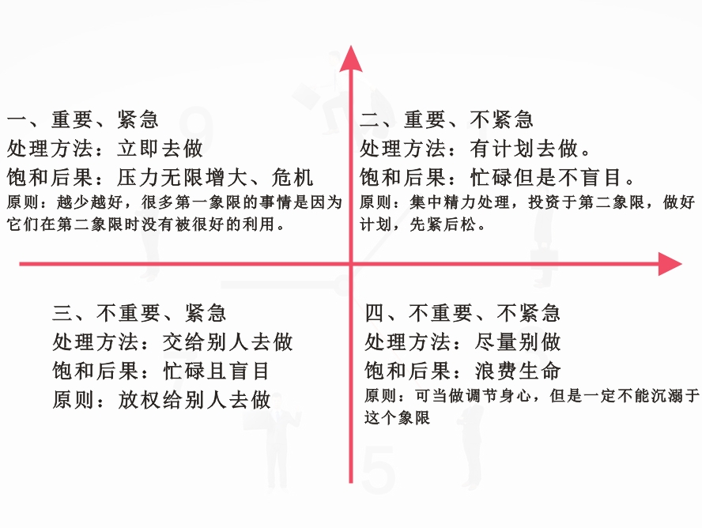

[TOC]

# 高效能人士的七个习惯笔记-notes

# 七个习惯概览

七个习惯：

1. 积极主动
2. 以始为终
3. 要事第一
4. 双赢思维
5. 知彼知己
6. 综合统效
7. 不断更新

# 前置问题

## 1.什么是效能？

效能就是产出和产能的平衡。
伊索寓言中有一则关于鹅生金蛋的故事，足以说明这个常遭违背的原则
> 一个农夫无意间发现一只会生金蛋的鹅，不久便成了富翁。可是财富却使他变得贪婪急躁，每天一个金蛋已经无法满足他，于是他异想天开地把鹅杀了，想将鹅肚子里金蛋全部取出。谁知道打开一看，鹅肚子里并没有金蛋。最后鹅死了，再也生不出金蛋。

这则寓言中蕴含了一个自然法则，即效能的基本定义。许多人都用金蛋模式来看待效能，即产出越多，效能越高。

而真正的效能应该包含两个要素：一是“产出”，即金蛋；二是“产能”——生产的资产或能力，即下金蛋的鹅。在生活中“重蛋轻鹅”的人，最终会连这个产金蛋的资产也保不住。反之，“重鹅轻蛋”的人，最后自己都可能会被活活饿死。所以，效能在于产出于产能的平衡。

思考：

* 如果从个人的角度去思考，金蛋就是自己的产出，鹅就是自己的产能，如果过度关注金蛋的产出（赚钱），忽视了身体健康和学习，最终可能得不偿失。
* 如果从企业的角度去思考，如果过度关注利润，忽视了员工的健康和学习，每周都是996，同样也会导致员工的离职。

## 2.什么是习惯？

习惯是知识、技巧和意愿相互交织的结果。 知识是理论范畴，指点“做什么”及“为何做”；技巧告知“如何做”；意愿促使“想要做”。要养成一种习惯，三者缺一不可。

## 3.人类成熟的三个时期

* 依赖期——以‘你’为核心，你照顾我；你得为我的得失成败负责。
* 独立期——以‘我’为核心，我可以做到；我可以负责；我可以靠自己；我有权选择。
* 互赖期——以‘我们’为核心，我们可以做到；我们可以合作；我们可以融合彼此的智慧和能力，共创前程。”
当我们开始“七个习惯”的学习，就代表要从依赖期转向独立期。走进独立期，很重要的一点，就是开始主动负责。

## 由内而外全面造就自己，重新探索自我

思维定式：

成长和改变的原则：承认自己的无知往往是求知的第一步。

# 习惯三：要事第一 - 自我管理的原则

## 时间管理四象限法则

## 提高效率或效能的方式之一 - 授权
授权：授权是提高效率或效能的秘诀之一，确实有些事情自己做起来更省时省事，随着我们职位的上升，我们需要负责更多的事务，需要带领更多的员工，这些事务已经不是我们自己可以做完的了，而且我们有着更重要的事情去做，去领导这些事务的发展，为这些事情制定标准、指明方向。这时候，我们把这些事务授权给自己的下属完成，自己则专注于自己这个职位该做的事情，不仅是个人的成长，也是团队的成长。

授权的分类：
* 指令型授权：指令型授权就是让别人“去做这个，去做那个，做完告诉我”。大部分生产者都具有这种指令型授权的行为模式。这种授权模式适合团队人数较少（个位数）的情况下，一个人总的负责这个事情，其他人则是他的帮手。
* 责任型授权：责任型授权的关注重点是最终的结果。它给人们自由，允许自行选择做事的方法，并为最终的结果负责。这种授权模式适合大团队（也就是团队人数比较多）的情况下，由一个人或者一个团队负责某一事务的进展。这种授权能够省去授权人非常多的时间，他们只要关注结果就好。

